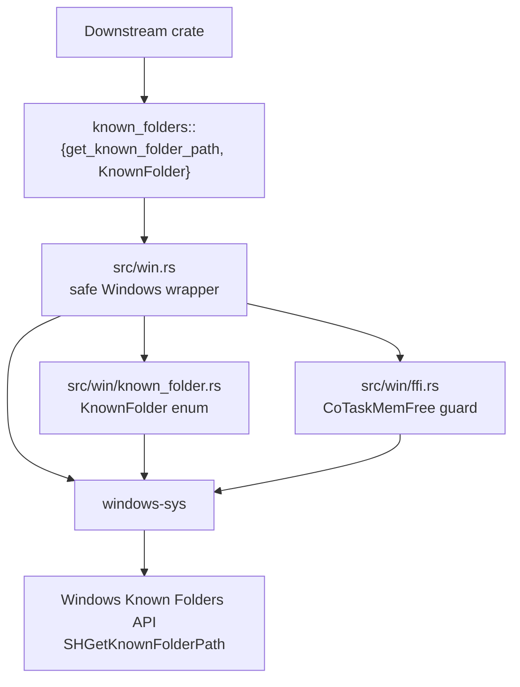
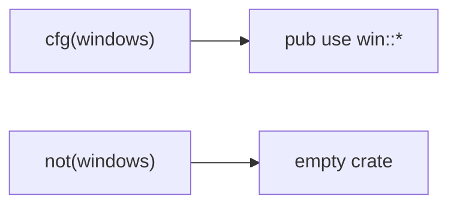
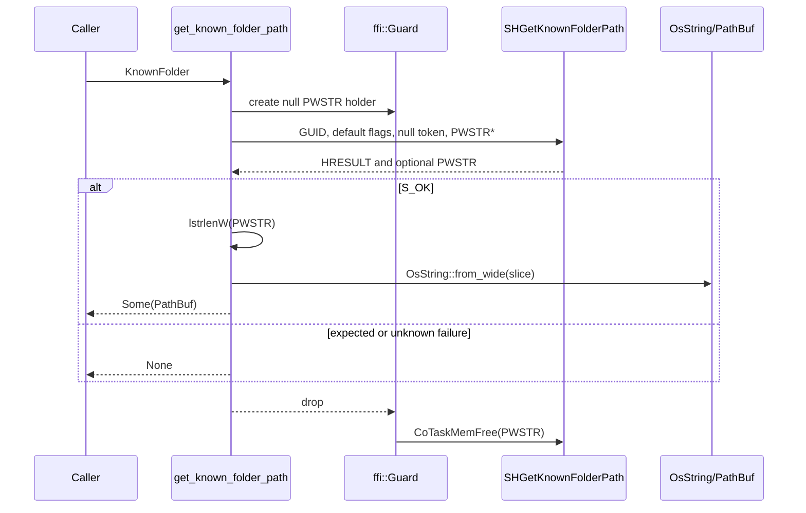

# Architecture

This document is a map of `known-folders-rs`. It should answer where code lives,
which boundaries matter, and what must stay true when changing the crate.

`known-folders-rs` is intentionally small. It exposes a safe Rust API for
resolving Windows Known Folder paths with `SHGetKnownFolderPath`. On non-Windows
targets the crate compiles, but exports no public API.

## Big Picture

The important design choice is that raw Windows behavior is contained at one
boundary. Safe callers pass a `KnownFolder` and receive `Option<PathBuf>`. They
never receive a raw pointer, allocate a Windows buffer, or decide how to free a
Windows-owned string.

## Source Layout

- [`src/lib.rs`](src/lib.rs) is the crate boundary. It defines lint policy,
  crate docs, docs.rs metadata, doctest setup, the Windows target gate, and
  re-exports the Windows implementation only on Windows.
- [`src/win.rs`](src/win.rs) is the safe wrapper implementation. It calls
  `SHGetKnownFolderPath`, handles expected HRESULTs, measures the returned wide
  string, converts UTF-16 into `OsString`, then returns a `PathBuf`.
- [`src/win/known_folder.rs`](src/win/known_folder.rs) is the public vocabulary
  of supported first-party Known Folder IDs. Each enum variant maps to a
  `windows-sys` `FOLDERID_*` GUID.
- [`src/win/ffi.rs`](src/win/ffi.rs) owns the narrow FFI helper state. `Guard`
  stores the `PWSTR` out pointer and frees it with `CoTaskMemFree` on drop.
- [`examples/get_profile_dir.rs`](examples/get_profile_dir.rs) is the smoke-test
  example for resolving `KnownFolder::Profile`.
- [`docs/`](docs/README.md) contains maintenance guardrails, dependency policy,
  and recurring automation runbooks. It is not user-facing API documentation.

## Public API Boundary

On Windows, the public API is:

- `KnownFolder`, a non-exhaustive enum of first-party Known Folder IDs provided
  by `windows-sys`.
- `get_known_folder_path(KnownFolder) -> Option<PathBuf>`, a safe lookup
  function for the current user.

On non-Windows targets, there are no public items. This is intentional and is a
compatibility surface. Do not add fallback behavior, environment-variable
lookups, synthetic paths, or cross-platform abstractions unless the crate's
public story changes.

## Lookup Flow

The guard is created before the Win32 call and is dropped after the borrowed
wide slice is no longer used. That order is the core memory-safety invariant in
the crate.

## FFI Boundary

The wrapper relies on these Windows API contracts:

- `SHGetKnownFolderPath` writes a `PWSTR` out parameter.
- The returned string is NUL-terminated on success.
- The caller must free the returned pointer with `CoTaskMemFree` whether the
  call succeeds or fails.
- `CoTaskMemFree(NULL)` is allowed and has no effect.
- `lstrlenW` measures the number of UTF-16 code units before the terminator.

Keep these contracts close to the FFI call. If lookup behavior changes, review:

- pointer initialization and ownership
- drop order for `ffi::Guard`
- UTF-16 length calculation
- conversion through `OsString::from_wide`
- HRESULT handling
- 32-bit and 64-bit allocation-size assumptions

## Dependency Boundary

`windows-sys` is target-specific and only enabled for `cfg(windows)`. The
supported version range is a public maintenance promise, not an implementation
detail.

Required feature groups are:

- `Win32_Foundation`
- `Win32_Globalization`
- `Win32_System_Com`
- `Win32_UI_Shell`

When changing the range or feature list, use
[`docs/automations/windows-sys.md`](docs/automations/windows-sys.md) and verify
the minimum and latest supported versions.

## Compatibility Surfaces

Treat these as user-visible:

- safe lookup behavior for each `KnownFolder` variant
- collapse of lookup failure into `None`
- Windows UTF-16 to `PathBuf` conversion
- `CoTaskMemFree` ownership handling
- non-Windows empty-crate behavior
- `windows-sys` supported version range
- MSRV and edition policy
- docs.rs target configuration
- public docs and examples

Changing any of these usually requires README or crate-doc updates and should be
called out in the PR.

## Making Changes

Use the smallest workflow that matches the change:

- Windows lookup, target gates, UTF-16, pointer ownership, or HRESULT behavior:
  read the platform, FFI, unsafe-code, and testing guardrails.
- `KnownFolder` variants or public API shape: read the API stability and
  platform guardrails.
- `windows-sys` range or features: read the dependency policy and `windows-sys`
  automation runbook.
- Docs-only changes: keep Rust behavior untouched, run text formatting, and
  explain any skipped Rust checks.

Prefer code that keeps the current architecture obvious: one safe public API,
one Windows implementation module, one enum vocabulary, one FFI ownership
helper.
